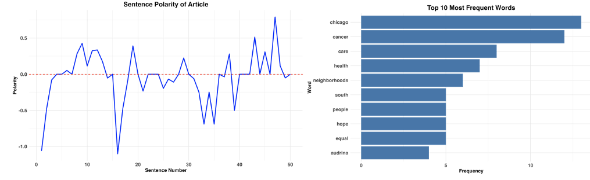
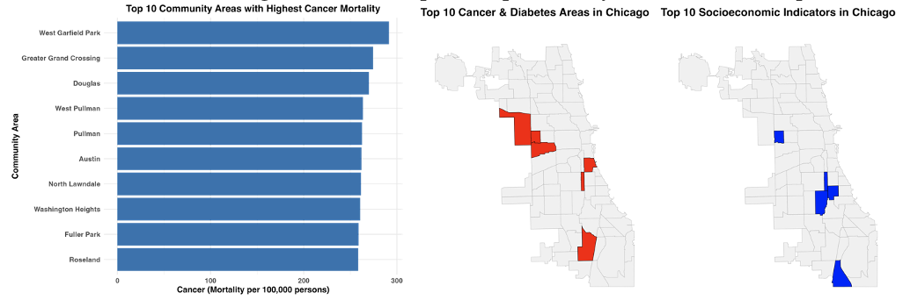
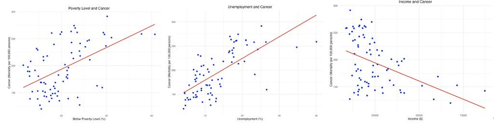
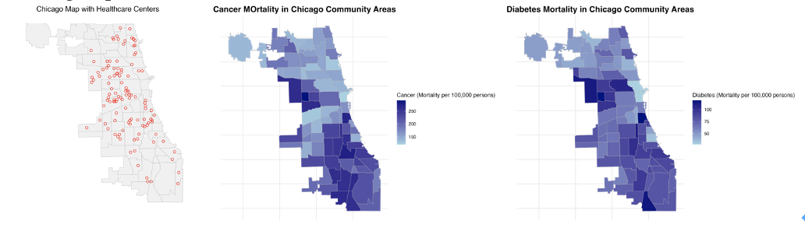

Relationship Between Socioeconomic Indicators and Public Health in Chicago

Sohyun Lim

1. Motivation and Research Question
Disparities in cancer care and health outcomes across Chicago underscore the significant influence of socioeconomic factors on public health. Communities in Chicago’s West and South Sides face profound challenges such as poverty, unemployment, and limited access to healthcare, resulting in disproportionately higher cancer and diabetes mortality rates. This study aims to investigate the relationship between socioeconomic indicators and public health disparities across Chicago’s 77 neighborhoods through quantitative analysis and visualization.

2. Data Sources
The research utilizes the following datasets:
1) CBS News Article: "Chicago's South, West Sides have many more cancer patients, less  
access to care." (https://www.cbsnews.com/chicago/news/cancer-care-disparities-1/)
2) Chicago Public Health Statistics from Chicago Data Portal  (https://data.cityofchicago.org/Health-Human-Services/Public-Health-Statistics-Selected-public-health-in/iqnk-2tcu/about_data): Key indicators include:
 - Health outcomes: Cancer and diabetes mortality rates (per 100,000 persons, age-adjusted).
 - Socioeconomic status: Poverty rate, unemployment rate, no high school diploma (%), and per capita income.
3) Chicago Public Health Service Map (https://data.cityofchicago.org/Health-Human-Services/Map-Public-Health-Services-Chicago-Primary-Care-Co/2usn-w2nz)
: Geographic locations of primary care health centers in Chicago.
4) Chicago Community Area Boundaries_shp file (https://data.cityofchicago.org/Facilities-Geographic-Boundaries/Boundaries-Community-Areas-current-/cauq-8yn6)
: Current community area boundaries in Chicago

3. Text Analysis
The CBS News article highlights significant barriers to healthcare access in underserved communities. Sentiment analysis revealed a polarity score of 0.1 and a subjectivity score of 0.38, indicating an objective yet slightly positive tone. This positivity is likely influenced by terms such as "Hope," despite the article’s focus on systemic inequities. Word frequency analysis further emphasizes terms like "cancer," "access," and "South Side," reflecting the article’s central theme of healthcare disparity. 
  

  

4. Descriptive Statistics
Choropleth maps of socioeconomic factors and health outcomes reveal a clear spatial correlation. Communities in the South and West Sides experience higher poverty and unemployment rates, lower income levels, and poorer health outcomes, highlighting the geographic concentration of inequities. This pattern suggests a strong link between socioeconomic disadvantage and health disparities, particularly in chronic disease prevalence.
     

5. Linear Regression Analysis
To further quantify the relationship between socioeconomic indicators and health outcomes, we conducted six simple linear regression models. Results indicate that poverty and unemployment rates are positively associated with higher cancer and diabetes mortality rates, while income shows a negative association. All models were statistically significant, underscoring the critical role of socioeconomic factors in shaping public health outcomes.

     

6. Spatial Analysis
Spatial analysis integrating healthcare accessibility reveals significant gaps in service coverage. Using a 1-mile buffer around healthcare centers, maps illustrate that many communities in the South and West Sides lie outside accessible zones. These areas not only face socioeconomic and health challenges but also encounter limited access to healthcare services, exacerbating existing disparities.

     

7. Shiny App Development
A Shiny app was developed to enhance the interactivity of the analysis. The app includes (1) a dropdown menu to select attributes, (2) a checkbox and slider to customize buffer zones, and (3) multiple layouts (choropleth maps and tables) to explore socioeconomic and health data alongside healthcare access. Also, three layouts (Choropleth map, Choropleth map overlap with buffer, and table for the attribute) are displayed to help people find meaningful information on socioeconomic indicators and health outcomes with healthcare accessibility.

8. Conclusion
This study identifies the West and South Sides of Chicago as areas with the greatest socioeconomic challenges and health inequities. Socioeconomic indicators, such as poverty and unemployment, are strongly correlated with adverse health outcomes. Additionally, significant gaps in healthcare accessibility further compound these disparities.  Based on these findings, policy implications include prioritizing investments in healthcare infrastructure and services in underserved areas like the West and South Sides of Chicago. Additionally, addressing socioeconomic determinants such as poverty and unemployment through targeted community programs and economic initiatives can significantly reduce health disparities and improve public health outcomes.

There are some limitations with this analysis in that it is relying on a limited text source and using a single-year dataset. Future research will address limitations by incorporating multi-year datasets, expanding text analysis to diverse sources, and refining the Shiny app to provide a more comprehensive understanding of public health disparities in Chicago.
